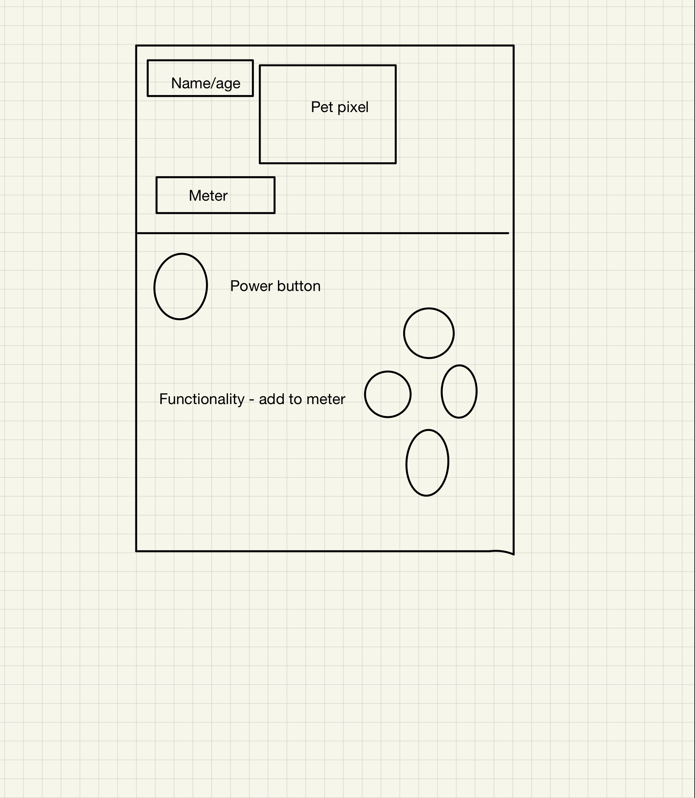

# Tomagatchi

To play game: https://jpark-2020.github.io/Tomagatchi-v2/

Wireframe: 

User Story: 
1. Objective of game: Keep tomagachi fed, excited, and well-rested with food, lights, play buttons 
2. On landing page, user is requested for an input which determines pet's name 
3. Once game starts, the pet's age will increase by increments of 1 every 5 seconds 
4. Once name is input, user sees a prototype gameboy where you can press buttons to feed, play with, and enable sleep for the pet 
5. The pet will pass on to the afterlife if the values of the hunger, sleepiness, or boredom meter exceeds 10, which will be signaled by an alert message 